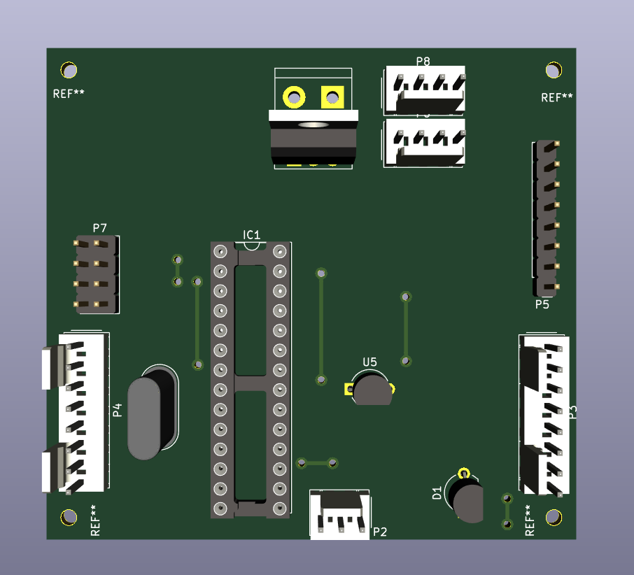
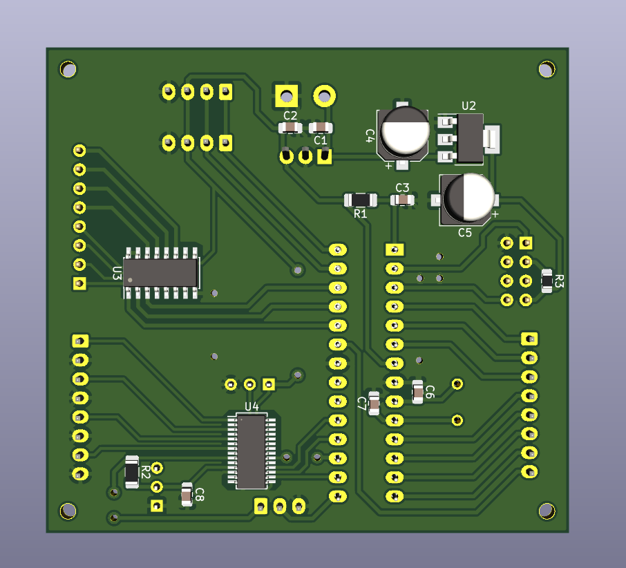

# Temperature controlled setup

## About

This repository contains documentation for assembling a low-cost heating system designed for manufacturing and characterization of gas sensors, including dedicated hardware and firmware, comprising a proportional-integral-derivative controller and user interface for its use. The hardware consists of a printed circuit board containing an analog-to-digital converter (LTC2439) for temperature measurements acquired by thermocouples and a microcontroller (ATmega328P) that coordinates the entire process running a finite-state machine.

## Hardware

Full schematics may be found [here](./hardware/schematics.pdf). PCB's Kicad project is under the *hardware* folder.

